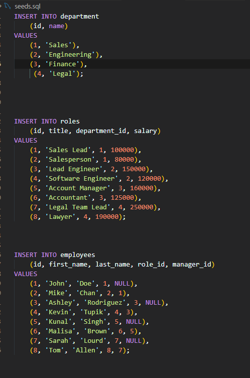

# Employee Management Application

This command-line application is designed to help you manage departments, roles, and employees in a company. It provides a user-friendly interface with various options to view and update information within the database.

## Features

- **View all departments:** Display a formatted table showing department names and IDs.
- **View all roles:** Present job titles, role IDs, associated departments, and salaries.
- **View all employees:** Show employee data, including IDs, first names, last names, job titles, departments, salaries, and manager information.
- **Add a department:** Easily add a new department by entering its name.
- **Add a role:** Add a new role by providing the name, salary, and associated department.
- **Add an employee:** Enter employee details such as first name, last name, role, and manager to add a new employee to the database.
- **Update an employee role:** Select an employee and their new role to update their information in the database.

## Usage

1. **Starting the Application:**
   - Run the application in your command-line interface.

2. **Main Menu:**
   - Upon starting, you will be presented with a menu containing the following options:
     - View all departments
     - View all roles
     - View all employees
     - Add a department
     - Add a role
     - Add an employee
     - Update an employee role

3. **Options Description:**
   - Select an option by entering the corresponding number.

4. **Viewing Information:**
   - Choose options 1-3 to view information in formatted tables.

5. **Adding Information:**
   - Choose options 4-6 to add new departments, roles, or employees. Follow the prompts to enter relevant information.

6. **Updating Employee Role:**
   - Choose option 7 to update an employee's role. Follow the prompts to select an employee and provide their new role.

7. **Exiting the Application:**
   - Choose an option to exit the application.

8. **------------------------------------------------------------**
   

## Installation

1. Clone the repository to your local machine.
   ```bash
   git clone https://github.com/Nurshat01/Employee-Tracker-DB.git

     - To install 'npm i inquirer@8.2.4' 
     - mysql2 'npm i mysql2' 
     - node 'npm init -y' 
     - console.table  'npm i console.table' 

## video
1 video: https://1drv.ms/v/s!At889SuyUenyiSQHKR6u9T7DZHfN?e=A7y1dg
